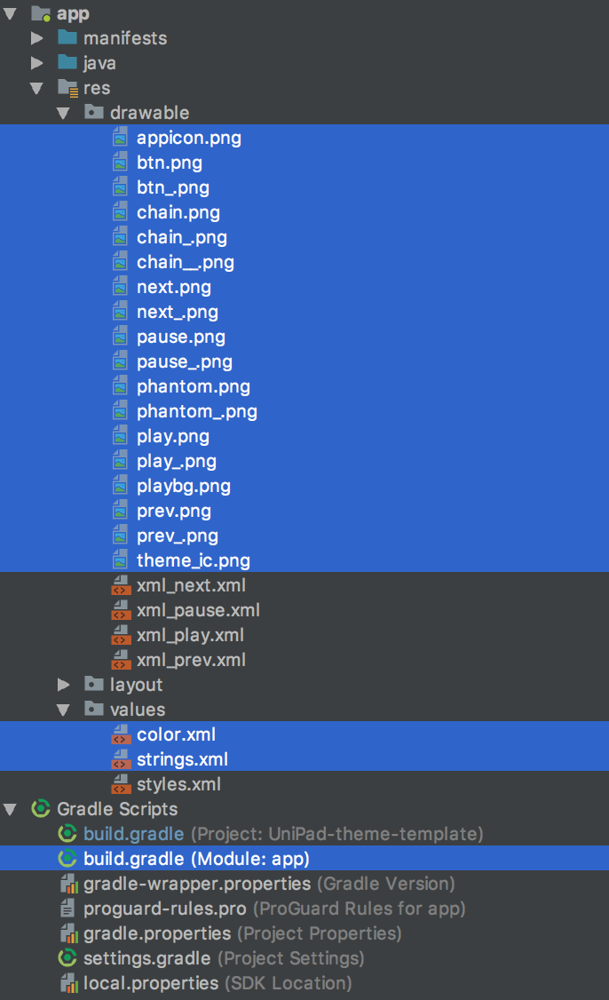

# UniPad theme template
유니패드에 적용할 수 있는 테마 앱의 탬플릿입니다.

## 수정해야 될 것들

## btn

### btn.png (32x32)

`버튼의 기본 색상`

### btn_.png (32x32)

`버튼이 눌렸을 때의 색상`

## chain

- chainled 파일이 없으면 chain, chain_, chain__ 시스템을 사용합니다.

### chainled (180x180)

`led 표시를 지원하기 위해서 배경이 채워진 체인`

### chain (180x180)

`기본 체인`

### chain_ (180x180)

`선택된 체인`

### chain__ (180x180)

`연습모드로 표기될 체인`

