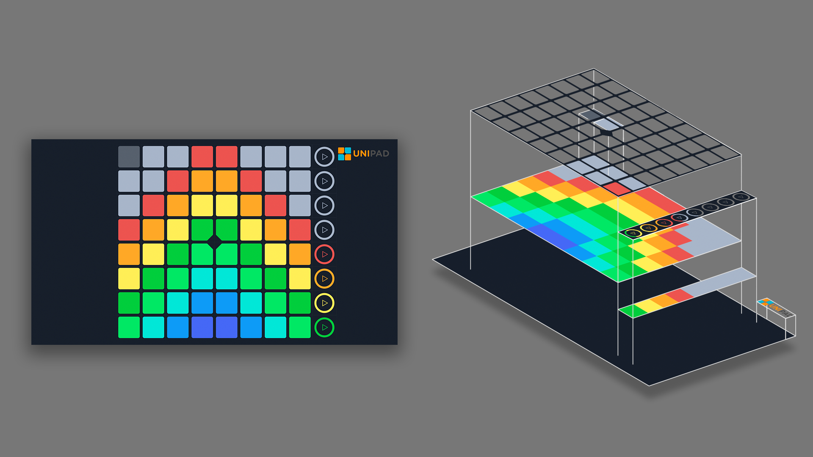

# UniPad theme template
Templates for theme apps that can be applied to UniPad.

## Files to remake


## Theme Structure


---

## string.xml
```xml
<resources>
	<string name="app_name">UniPad theme template</string>

	<string name="theme_name">UniPad - Theme template</string>
	<string name="theme_description">This is theme template</string>
	<string name="theme_author">UniPad</string>
</resources>
```

---

## color.xml
```xml
<resources>
	<!--skin-->
	<color name="checkbox">#a6b4c9</color>
	<color name="trace_log">#161e2b</color>
	<color name="option_window">#FFFFFF</color>
	<color name="option_window_checkbox">#414F66</color>
	<color name="option_window_btn">#d6d8d7</color>
	<color name="option_window_btn_text">#0f0f0f</color>
	
	<!--app color-->
	<color name="app_orange">#ff8f00</color>
	<color name="app_blue">#00b8d4</color>
	<color name="app_blue_dark">#009db5</color>
</resources>
```

---

## build.gradle (Module: app)
```javascript
apply plugin: 'com.android.application'

android {
    compileSdkVersion 26
    defaultConfig {
        applicationId "com.kimjisub.launchpad.theme.template"   //change this
        minSdkVersion 16
        targetSdkVersion 26
        versionCode 1                                           //change this
        versionName "1.0.0"                                     //change this
        testInstrumentationRunner "android.support.test.runner.AndroidJUnitRunner"
    }
    buildTypes {
        release {
            minifyEnabled false
            proguardFiles getDefaultProguardFile('proguard-android.txt'), 'proguard-rules.pro'
        }
    }
}
```

---

## btn (32x32)


`The default color of the pad`

## btn_ (32x32)


`The color when the button is pressed`

---

```
Put only resources for the system you are using.
If all 4 resources are present, it will work by chainled mode.
```

## chain, chain_, chain__ (180x180) Normal Mode


`The basic chain, the selected chain, the chain to be marked as the practice mode`

## chainled (180x180) Chainled Mode


`To support the LED display, the background filled chain image`

---

## prev, play, pause, next, prev_, play_, pause_, next_ (180x180)

```
aaaa  : not touched yet.
aaaa_ : While touching.
```


---

## phantom (180x180)

```
If Phantom_.png is not exist, apply phantom.png
If the unipack size is over 16 * 16, it will not apply
Both horizontal and vertical numbers must be even number
```


`Image over pad`

## phantom_ (180x180)


`Images put over the center 4 pad`

---

## playbg (unfixed)


`Images to be used in the background`

## custom_logo (unfixed)


`Logo on top right, disappear when not exist this file`

---

## appicon (512x512)


`Icons representing skin, used as skin app icons`

---

## theme_ic (512x512)


`Icon representing skin, shown in skin selection window`

---
